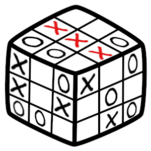

# rubikamob - TicTacToe on a Rubik's cube!
This simple game merges two famous games to improve on TicTacToe.  
The rules are simple, while you play TicTacToe on the 3x3 top grid of a Rubik's cube, you can also rotate the cube to deny a win of your opponent or just moving on from a draw situation.

Connecting three symbols only yields a win when achieved on the top face. You can either place a symbol or rotate the cube revealing some hidden marks.

### Compile for C
`gcc -o rubikamob rubikamob.c`

